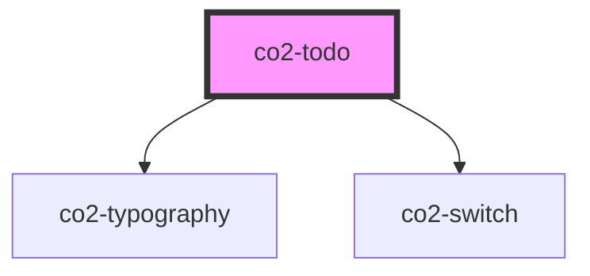

# co2-todo

<!-- Auto Generated Below -->

## Properties

| Property | Attribute | Description                             | Type      | Default     |
| -------- | --------- | --------------------------------------- | --------- | ----------- |
| `index`  | `index`   | Index prop                              | `number`  | `0`         |
| `isDone` | `is-done` | isDone prop (checks or unchecks switch) | `boolean` | `undefined` |
| `task`   | `task`    | Todo task text prop                     | `string`  | `''`        |

## Dependencies

### Depends on

- [co2-typography](../../mdc/typography)
- [co2-switch](../../mdc/switch)

### Graph

----------------------------------------------

*Built with [StencilJS](https://stenciljs.com/)*
