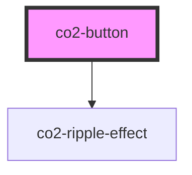

# co2-button

<!-- Auto Generated Below -->

## Properties

| Property     | Attribute     | Description             | Type      | Default     |
| ------------ | ------------- | ----------------------- | --------- | ----------- |
| `isDisabled` | `is-disabled` | HTML disabled attribute | `boolean` | `undefined` |

## Events

| Event        | Description      | Type               |
| ------------ | ---------------- | ------------------ |
| `scaleClick` | HTML click event | `CustomEvent<any>` |

## Dependencies

### Depends on

- [co2-ripple-effect](../ripple-effect)

### Graph

----------------------------------------------

*Built with [StencilJS](https://stenciljs.com/)*
