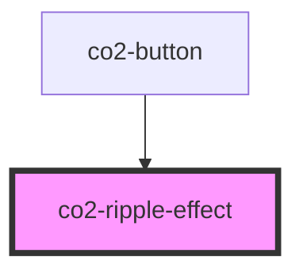

# co2-ripple-effect

<!-- Auto Generated Below -->

## Properties

| Property          | Attribute   | Description                                                    | Type          | Default     |
| ----------------- | ----------- | -------------------------------------------------------------- | ------------- | ----------- |
| `active`          | `active`    | Whether or not the surface the ripple is acting upon is active | `boolean`     | `undefined` |
| `disabled`        | `disabled`  | Disables the ripple effect                                     | `boolean`     | `false`     |
| `interactionNode` | --          | The node which should trigger the Ripple Effect                | `HTMLElement` | `undefined` |
| `unbounded`       | `unbounded` | Whether or not the ripple is unbounded                         | `boolean`     | `false`     |

## Dependencies

### Used by

 - [co2-button](../button)

### Graph

----------------------------------------------

*Built with [StencilJS](https://stenciljs.com/)*
