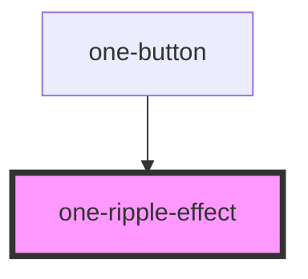

## Try it yourself!

[Playroom](http://playroom-web.onedesign.roche.com#?code=N4Igxg9gJgpiBcIA8B5AdjAQgVwC64jQD4AJCAGwENUMAlASwAdHyYBRAMw5jFyKQD06GA2atO3XvyEYc+QkQA6aJACMATtI1KVwuQWJkqNEUxbsuPXAAIo9AM6VVrALyKQuddhjvpw0eYSVn6yeAY6apqC2som+gpG1P5m4pa81thoqhCZsFBuHl4+ICGmYhaSfIJ6YQrKIAA0HgAWMAC2MPYIANogUJTqANYAKq0dIAC6TQDu9FC4zV3w3RMAvkA)

<!-- Auto Generated Below -->

## Properties

| Property          | Attribute   | Description                                                    | Type          | Default                      |
| ----------------- | ----------- | -------------------------------------------------------------- | ------------- | ---------------------------- |
| `active`          | `active`    | Whether or not the surface the ripple is acting upon is active | `boolean`     | `undefined`                  |
| `disabled`        | `disabled`  | Disables the ripple effect                                     | `boolean`     | `false`                      |
| `interactionNode` | --          | The node which should trigger the Ripple Effect                | `HTMLElement` | `this.element.parentElement` |
| `unbounded`       | `unbounded` | Whether or not the ripple is unbounded                         | `boolean`     | `false`                      |

## Dependencies

### Used by

 - [one-button](../button)

### Graph

----------------------------------------------

*Built with [StencilJS](https://stenciljs.com/)*
