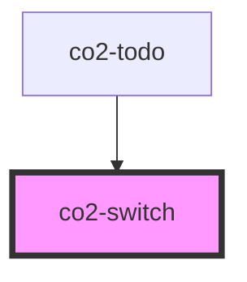

# co2-switch

<!-- Auto Generated Below -->

## Properties

| Property     | Attribute     | Description           | Type      | Default    |
| ------------ | ------------- | --------------------- | --------- | ---------- |
| `isChecked`  | `is-checked`  | HTML is-checked prop  | `boolean` | `false`    |
| `isDisabled` | `is-disabled` | HTML is-disabled prop | `boolean` | `false`    |
| `label`      | `label`       | HTML label prop       | `string`  | `'off/on'` |

## Events

| Event         | Description         | Type               |
| ------------- | ------------------- | ------------------ |
| `scaleChange` | HTML onChange event | `CustomEvent<any>` |

## Dependencies

### Used by

 - [co2-todo](../../custom/co2-todo)

### Graph

----------------------------------------------

*Built with [StencilJS](https://stenciljs.com/)*
