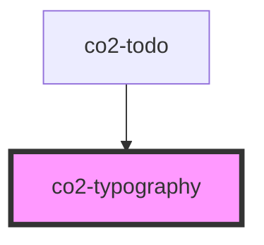

# co2-typography

<!-- Auto Generated Below -->

## Properties

| Property | Attribute | Description    | Type                                                                                                                                                                                                                                                                                                                                                                                | Default                  |
| -------- | --------- | -------------- | ----------------------------------------------------------------------------------------------------------------------------------------------------------------------------------------------------------------------------------------------------------------------------------------------------------------------------------------------------------------------------------- | ------------------------ |
| `type`   | `type`    | HTML type prop | `TypographyTypes.BODY_1 \| TypographyTypes.BODY_2 \| TypographyTypes.BUTTON \| TypographyTypes.CAPTION \| TypographyTypes.HEADLINE_1 \| TypographyTypes.HEADLINE_2 \| TypographyTypes.HEADLINE_3 \| TypographyTypes.HEADLINE_4 \| TypographyTypes.HEADLINE_5 \| TypographyTypes.HEADLINE_6 \| TypographyTypes.OVERLINE \| TypographyTypes.SUBTITLE_1 \| TypographyTypes.SUBTITLE_2` | `TypographyTypes.BODY_1` |

## Dependencies

### Used by

 - [co2-todo](../../custom/co2-todo)

### Graph

----------------------------------------------

*Built with [StencilJS](https://stenciljs.com/)*
